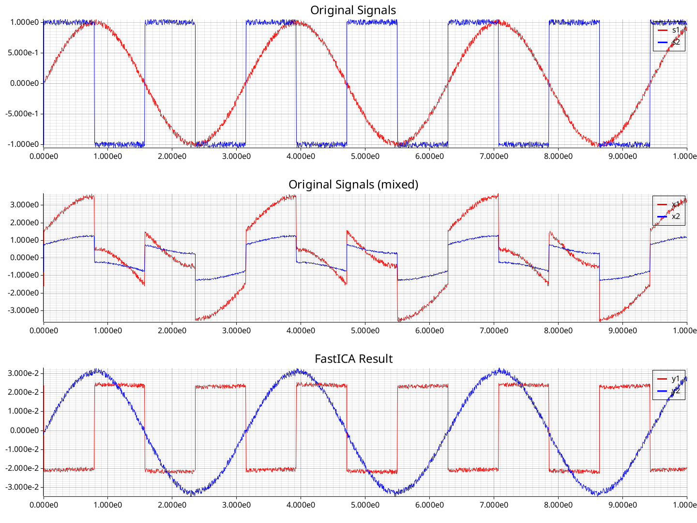

# FastICA Demo Code

A demo using `linfa-ica` showcasing the FastICA algorithm. The `linfa-ica` crate is part of the `linfa` ([repo](https://github.com/rust-ml/linfa)) family, Rust Machine Learning implementations akin to Python's scikit-learn.

- [FastICA Demo Code](#fastica-demo-code)
  - [How to install](#how-to-install)
  - [How to run](#how-to-run)
    - [Simple](#simple)
    - [Custom](#custom)
  - [References](#references)
  - [Example Output](#example-output)

## How to install

0. download the code: `git clone git@github.com:ArckyPN/sam-ws24.git`
1. install Rust, follow the instruction from the official installer: [rustup.rs](https://rustup.rs/)
2. done

> [!IMPORTANT]
> If you are running Ubuntu or Fedora Linux, you will also need to install some [dependencies](https://github.com/plotters-rs/plotters?tab=readme-ov-file#dependencies) to be able to plot the output

## How to run

There two ways to run the demo: 

### Simple

This will use the default values of the defined CLI. Simply run any of the following commands

```shell
# this will create a plot using sine and box waves
cargo run -- example

# this will create a plot using the provided mp3 files
# and save the mixed and ICA extracted signals
cargo run -- speech
```

### Custom

Using the help flag (or command) you can see what the CLI looks like:

```shell
# help of the root program
cargo run -- [-h|--help|help]
```

## References

The provided audio files are taken from _Open Speech and Language Resources_ ([link](http://www.openslr.org/12)), specifically the `test-clean` dataset:

- speaker1.mp3 <-> /test-clean/237/134500/237-134500-0031.flac
- speaker2.mp3 <-> /test-clean/908/31957/908-31957-0008.flac

The FLAC files have been converted to mp3 with [FFmpeg](https://www.ffmpeg.org/) using

```shell
ffmpeg -i [input].flac -ab 320k -map_metadata 0 -id3v2_version 3 [output].mp3
```

## Example Output

All of the following plots were created using the same command `cargo run --release -- example` by repeatedly running it.

||
|:-:|
|ICA extracted results are expected|

||
|:-:|
|ICA extracted results show the ambiguities, Signals have switched places and Box Wave is flipped|

||
|:-:|
|ICA extracted results are flawed|
